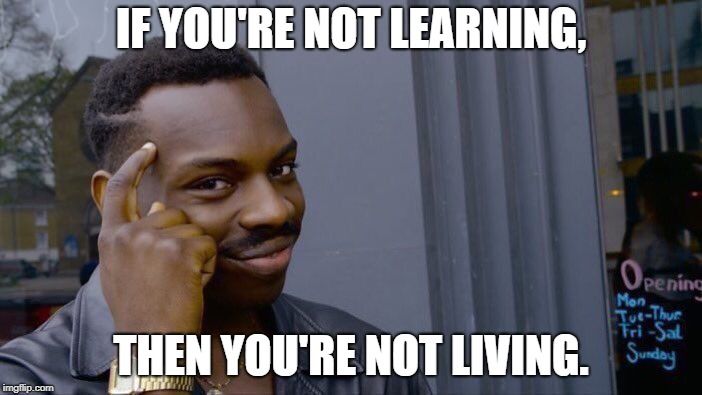
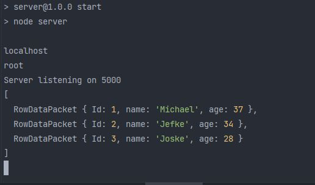

# Creating a Back-end Node.js/Express and front React Project!

### Learning Objective
- Create a Back-end with Node.js and Express
- Make API endpoints in the back-end 
- Fetch all this data in the front-end with React and display the data
- After this we will make our own exercise with a database and CRUD in the back-end.

<br>

- 

### Installation 

After making a new project in your GitHub, make two folders in your project 
<br>
- client 
    - Inside the client directory we gonna npx create-react-app .
    <br>
- server
    - Inside the server directory I will use "npm init -y" to say yes on all the questions and create a package.json file.
    - In this file I change the name of 'main' to server.js, and I create a new file -> touch server.js
    - We also need to install Express -> npm i express.
    - I will also install Nodemon so when we make changes to the server, it will automatically re-start the server -> npm i nodemon -D
    - In the package.json file I add two 'scripts: "start": "node server" and "dev": "nodemon server".
    
    
### First mission of this Exercise: Creating A users API in the Back-end and display them in the Front-end

- First we created a server.js file and inside we create the following:
- We make 4 users with a get request and a /api. We also let the server listen on port 5000.
```js
const express = require('express')
const app = express()

app.get("/api", (req, res) =>{
    res.json({"users": ["UserOne", "UserTwo", "UserThree", "UserFour"]})
})

app.listen(5000,() => {console.log ("Server started on port 5000")})
```

- In the Front-end we can now use this information to display this:
- First we make a useState and a useEffect to fetch our data from the back-end. 
- Then we can map over all the data and display it in on our screen. 
```js
function App() {

  const [backendData, setBackendData] = useState([{}])

  useEffect(() => {
    fetch("/api")
            .then(response => response.json())
            .then(data => {
                      setBackendData(data)
                    }
            )
  }, [])

  return (
          <div>
            {(typeof backendData.users === 'undefined') ? (
                    <p>Loading ... Please Wait</p>
            ) : (
                    backendData.users.map((user, i) => (
                            <p key={i}>{user}</p>
                    ))
            )}
          </div>
  );
}
```

### Second mission: Lets connect a database to our back-end that we can make a CRUD.

- I made a new Schema on Datagrip with a user Table. Inside here I made some mockup data ( 3 users with name and age).
- In our project I installed Dotenv of course for security reasons, and managed to connect to our database. 
- First I made A few folders to help us get some structure in our project! 
  - helpers -> Here we will store the database.js information 
  - models -> Here I made a user class to make SQL queries to the database
  
- In our database.js file I did a test to see if we could see our self made users.
```js
connection.connect(function(err) {
    if (err) throw err;
    connection.query("SELECT * FROM user", function (err, result, fields) {
        if (err) throw err;
        console.log(result);
    });
});
```

- Here you can see the test we performed: 
<br>
- 

### Third mission: Displaying this information in the Front-End. 